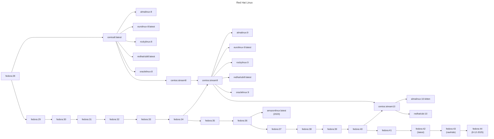

# Red Hat Linux Image Diagram

## Disclaimer

This diagram is meant for general information to show the upstreams from various images to mimic Red Hat Enterprise Linux (RHEL). Red Hat stopped publishing the source code to RHEL in 2023. The area from version 8 may not be 100% correct.

## Release Cadence

### Fedora

- Release: 6 months
- Active: 1 year

### CentOS Stream

- Release: 3 years
- Active: ~5 years

### Red Hat Enterprise Linux

- Release: 3 years
- Active: 10 years